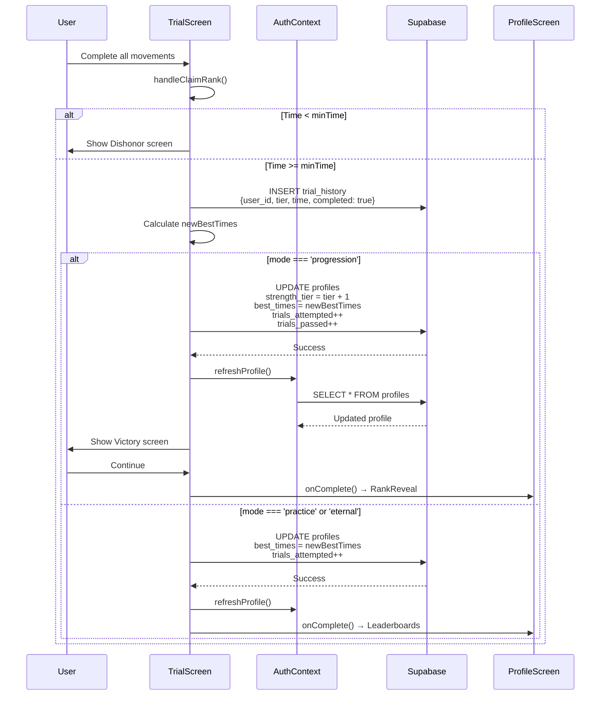

# Leap Calispath — Complete Project Architecture

## Diagram 1: Master Navigation & Screen Hierarchy

```mermaid
flowchart TD
    subgraph Entry["📱 App Entry"]
        A([App Opens]) --> B{Authenticated?}
        B -->|No| C[AuthScreen]
        C -->|signUp/signIn| D[Supabase Auth]
        D -->|Success| E{Assessed?}
        B -->|Yes| E
    end

    subgraph Onboarding["🚪 Onboarding Flow"]
        E -->|No| F[AssessmentGateScreen<br/>onStartAssessment={() => setShowAssessment(true)}]
        F --> G[AssessmentScreen<br/>9 movement trials]
        G -->|onComplete| H[RankRevealScreen<br/>Tier reveal ceremony]
        H -->|onContinue| I[ProfileScreen]
        E -->|Yes| I
    end

    subgraph MainHub["🏛️ ProfileScreen — Main Hub"]
        I --> J[World Selector Pills]
        J -->|STRENGTH| K[Strength View<br/>Tier Grid 0-8]
        J -->|⚡ POWER| L{Power Unlocked?<br/>Tier ≥ 6?}
        L -->|No| M[Locked 🔒<br/>Reach Strategos]
        L -->|Yes| N[Power View<br/>Tier Grid 0-8]
        J -->|🧊 STATIC| O[Locked 🔒<br/>Coming Soon]
        
        K -->|Tap Tier| P[Tier Modal<br/>onStartTrial(tier)]
        N -->|Tap Tier| Q[Power Tier Modal<br/>onStartPowerAssessment()]
        
        I -->|onViewLeaderboards| R[LeaderboardScreen<br/>category, tier]
        I -->|onViewStaticWorld| S[StaticWorldScreen<br/>Currently locked]
        I -->|onStartPowerAssessment| T[PowerAssessmentScreen]
    end

    subgraph TrialFlow["⚔️ TrialScreen — 3 Modes"]
        P --> U{Trial Mode}
        U -->|progression| V[Current Tier Trial<br/>Must pass to advance]
        U -->|practice| W[Lower Tier Practice<br/>No advancement]
        U -->|eternal| X[Tier 8 Eternal<br/>Endless mode]
        
        V --> Y[Timer + Movements]
        W --> Y
        X --> Y
        
        Y -->|Complete| Z{Time < minTime?}
        Z -->|Yes| AA[Dishonor Screen]
        Z -->|No| AB[Save to DB]
        AB --> AC{Progression?}
        AC -->|Yes| AD[strength_tier++<br/>Rank Reveal]
        AC -->|No| AE[Back to Leaderboards]
        
        Y -->|Abandon| AF[Log to trial_history<br/>completed: false]
        AF --> AG{Practice/Eternal?}
        AG -->|Yes| AE
        AG -->|No| I
    end

    subgraph PowerFlow["⚡ PowerAssessmentScreen"]
        T --> AH[Weight Inputs<br/>pullup, dip, squat, muscleup]
        AH --> AI[Calculate Score<br/>total = p + d + s + (m×2)]
        AI --> AJ[Calculate Tier<br/>Threshold check]
        AJ --> AK{Tier > current?}
        AK -->|Yes| AL[Update power_tier]
        AK -->|No| AM[Keep current]
        AL --> AN[Save to profiles<br/>power_pbs, power_points]
        AM --> AN
        AN --> AO{Score > existing?}
        AO -->|Yes| AP[Upsert power_assessments]
        AO -->|No| AQ[Skip update]
        AP --> AR[Power Leaderboards]
        AQ --> AR
        T -->|Abandon| AR
    end

    subgraph Leaderboard["🏆 LeaderboardScreen"]
        R --> AS{Category?}
        AS -->|strength| AT[Fetch from leaderboard_entries<br/>ORDER BY best_time ASC]
        AS -->|power| AU[Fetch from power_assessments<br/>ORDER BY pullup_1rm DESC]
        
        AT --> AV[Show entries<br/>rank, name, time]
        AU --> AW[Calculate scores<br/>Show rankings]
        
        AV --> AX[Buttons:<br/>PRACTICE → onPracticeTier<br/>ETERNAL → onStartEternal]
        AW --> AY[Button:<br/>ASSESS → onStartPowerAssessment]
    end

    style Entry fill:#1B5E20,stroke:#2E7D32,stroke-width:2px
    style Onboarding fill:#4E342E,stroke:#6D4C41,stroke-width:2px
    style MainHub fill:#1565C0,stroke:#1976D2,stroke-width:2px
    style TrialFlow fill:#E65100,stroke:#F57C00,stroke-width:2px
    style PowerFlow fill:#6A1B9A,stroke:#8E24AA,stroke-width:2px
    style Leaderboard fill:#00695C,stroke:#009688,stroke-width:2px
```

---

## Diagram 2: Database Schema & Data Flows

```mermaid
flowchart LR
    subgraph Supabase["🗄️ Supabase Database"]
        subgraph Tables["Tables"]
            PROFILES[profiles<br/>━━━━━━━━<br/>id: uuid PK<br/>display_name: text<br/>strength_tier: int<br/>power_tier: int<br/>best_times: jsonb<br/>power_pbs: jsonb<br/>assessed_at: timestamptz<br/>power_assessed_at: timestamptz<br/>trials_attempted: int<br/>trials_passed: int]
            
            TRIAL_HIST[trial_history<br/>━━━━━━━━<br/>id: uuid PK<br/>user_id: uuid FK→profiles<br/>tier_attempted: int<br/>time_seconds: int<br/>completed: boolean<br/>created_at: timestamptz]
            
            LB_ENTRIES[leaderboard_entries<br/>━━━━━━━━<br/>id: uuid PK<br/>user_id: uuid FK→profiles<br/>tier: int<br/>best_time_seconds: int<br/>updated_at: timestamptz]
            
            POWER_ASSESS[power_assessments<br/>━━━━━━━━<br/>user_id: uuid PK<br/>power_tier: int<br/>pullup_1rm: float<br/>dip_1rm: float<br/>squat_1rm: float<br/>muscleup_1rm: float<br/>assessed_at: timestamptz]
            
            STATIC_HOLDS[static_holds<br/>━━━━━━━━<br/>user_id: uuid PK<br/>movement_id: text<br/>hold_seconds: int<br/>points: int<br/>assessed_at: timestamptz]
        end
        
        subgraph RLS["Row Level Security"]
            RLS1[profiles: Users can only<br/>read/update own profile]
            RLS2[trial_history: Users can only<br/>read own history]
            RLS3[leaderboard_entries: Public read,<br/>own write via RPC]
            RLS4[power_assessments: Public read,<br/>own upsert]
        end
    end

    subgraph AppOperations["📲 App Operations"]
        OP1[INSERT trial_history<br/>on trial complete/abandon]
        OP2[UPDATE profiles<br/>on tier advancement]
        OP3[UPSERT leaderboard_entries<br/>on new PB]
        OP4[SELECT via RPC<br/>get_tier_leaderboard]
        OP5[SELECT .from('power_assessments')<br/>with profiles join]
        OP6[UPSERT power_assessments<br/>on score improvement]
    end

    OP1 --> TRIAL_HIST
    OP2 --> PROFILES
    OP3 --> LB_ENTRIES
    OP4 --> LB_ENTRIES
    OP5 --> POWER_ASSESS
    OP6 --> POWER_ASSESS
    
    TRIAL_HIST -->|user_id| PROFILES
    LB_ENTRIES -->|user_id| PROFILES
    POWER_ASSESS -->|user_id| PROFILES

    style Supabase fill:#37474F,stroke:#455A64,stroke-width:2px
    style Tables fill:#263238,stroke:#37474F,stroke-width:1px
    style AppOperations fill:#1565C0,stroke:#1976D2,stroke-width:2px
```

---

## Diagram 3: State Management & Navigation Logic

```mermaid
flowchart TD
    subgraph IndexState["🎯 app/index.tsx State Machine"]
        direction TB
        
        STATE1[showAssessment: boolean<br/>AssessmentScreen visibility]
        STATE2[showRankReveal: boolean<br/>RankRevealScreen visibility]
        STATE3[showTrial: boolean<br/>TrialScreen visibility]
        STATE4[showLeaderboards: boolean<br/>LeaderboardScreen visibility]
        STATE5[showPowerAssessment: boolean<br/>PowerAssessmentScreen visibility]
        STATE6[showStaticWorld: boolean<br/>StaticWorldScreen visibility]
        
        CONFIG1[trialMode: 'progression' | 'practice' | 'eternal']
        CONFIG2[practiceTier: number | null]
        CONFIG3[leaderboardCategory: 'strength' | 'power']
        CONFIG4[leaderboardTier: number]
    end

    subgraph NavigationFlow["🧭 Navigation Flow Logic"]
        START[User Action] --> CHECK1{showPowerAssessment?}
        CHECK1 -->|Yes| POWER_SCREEN[Return PowerAssessmentScreen]
        CHECK1 -->|No| CHECK2{showStaticWorld?}
        
        CHECK2 -->|Yes| STATIC_SCREEN[Return StaticWorldScreen]
        CHECK2 -->|No| CHECK3{showAssessment?}
        
        CHECK3 -->|Yes| ASSESS_SCREEN[Return AssessmentScreen]
        CHECK3 -->|No| CHECK4{showTrial?}
        
        CHECK4 -->|Yes| TRIAL_SCREEN[Return TrialScreen<br/>with mode & practiceTier]
        CHECK4 -->|No| CHECK5{showLeaderboards?}
        
        CHECK5 -->|Yes| LB_SCREEN[Return LeaderboardScreen<br/>with category & tier]
        CHECK5 -->|No| CHECK6{showRankReveal?}
        
        CHECK6 -->|Yes| RANK_SCREEN[Return RankRevealScreen]
        CHECK6 -->|No| CHECK7{isAssessed?}
        
        CHECK7 -->|No| GATE_SCREEN[Return AssessmentGateScreen]
        CHECK7 -->|Yes| PROFILE_SCREEN[Return ProfileScreen<br/>Main Hub]
    end

    subgraph StateTransitions["🔄 Key State Transitions"]
        T1[onComplete PowerAssessment<br/>→ setShowPowerAssessment(false)<br/>→ setLeaderboardCategory('power')<br/>→ setLeaderboardTier(newTier)<br/>→ setShowLeaderboards(true)]
        
        T2[onComplete Trial (progression)<br/>→ setShowTrial(false)<br/>→ setShowRankReveal(true)]
        
        T3[onComplete Trial (practice/eternal)<br/>→ setShowTrial(false)<br/>→ setShowLeaderboards(true)]
        
        T4[onAbandon Trial<br/>→ Log to trial_history<br/>→ Navigate based on mode]
        
        T5[onStartTrial from Profile<br/>→ Determine mode based on tier<br/>→ setTrialMode(mode)<br/>→ setPracticeTier(tier)<br/>→ setShowTrial(true)]
    end

    style IndexState fill:#37474F,stroke:#455A64,stroke-width:2px
    style NavigationFlow fill:#1565C0,stroke:#1976D2,stroke-width:2px
    style StateTransitions fill:#4A148C,stroke:#6A1B9A,stroke-width:2px
```

---

## Diagram 4: Component Hierarchy & Props

```mermaid
flowchart TD
    subgraph Root["🌳 Component Tree"]
        ROOT[SpartanLayout<br/>━━━━━━━━<br/>Theme wrapper<br/>SafeArea provider]
        
        subgraph Screens["Screen Components"]
            AUTH[AuthScreen<br/>━━━━━━━━<br/>Props: none<br/>Uses: useAuth, useTheme<br/>State: isSignUp, email, password]
            
            GATE[AssessmentGateScreen<br/>━━━━━━━━<br/>Props: onStartAssessment<br/>Button → Start assessment]
            
            ASSESS[AssessmentScreen<br/>━━━━━━━━<br/>Props: onComplete<br/>9 movement trials<br/>Auto-calculates tier]
            
            RANK[RankRevealScreen<br/>━━━━━━━━<br/>Props: profile, onContinue<br/>Tier reveal animation]
            
            PROFILE[ProfileScreen<br/>━━━━━━━━<br/>Props: onStartTrial, onViewLeaderboards,<br/>onViewStaticWorld, onStartPowerAssessment,<br/>initialCategory<br/>━━━━━━━━<br/>State: category, selectedTier,<br/>showTierModal, modalTier]
            
            TRIAL[TrialScreen<br/>━━━━━━━━<br/>Props: mode, practiceTier,<br/>onComplete, onAbandon<br/>━━━━━━━━<br/>State: isRunning, timeSeconds,<br/>completedMovements, showVictory]
            
            LEADERBOARD[LeaderboardScreen<br/>━━━━━━━━<br/>Props: onClose, onPracticeTier,<br/>onStartEternal, onStartPowerAssessment,<br/>initialCategory, initialTier<br/>━━━━━━━━<br/>State: category, selectedTier,<br/>entries, personalBest]
            
            POWER[PowerAssessmentScreen<br/>━━━━━━━━<br/>Props: onComplete, onAbandon<br/>━━━━━━━━<br/>State: inputs {pull_up, dip,<br/>squat, muscle_up}, loading]
            
            STATIC[StaticWorldScreen<br/>━━━━━━━━<br/>Props: onClose<br/>━━━━━━━━<br/>State: selectedCategory,<br/>selectedMovement, selectedLevel]
        end
        
        subgraph Contexts["React Contexts"]
            AUTH_CTX[AuthContext<br/>━━━━━━━━<br/>user, profile, loading<br/>signUp, signIn, signOut<br/>refreshProfile]
            
            THEME_CTX[ThemeContext<br/>━━━━━━━━<br/>theme: colors, fonts<br/>dark mode support]
        end
        
        subgraph LibFunctions["Library Functions"]
            LB[getTierLeaderboard<br/>getPowerTierLeaderboard<br/>getStaticMovementLeaderboard<br/>getStaticLevelLeaderboard]
            
            POWER_LOGIC[calculatePowerScore<br/>calculatePowerTier<br/>isPowerWorldUnlocked]
            
            STATIC_LOGIC[calculatePoints<br/>getLevelMovements<br/>getCategoryMovements<br/>isStaticWorldUnlocked]
            
            TRIALS[getTrialForTier<br/>formatTime<br/>RITES_OF_PASSAGE]
        end
    end

    ROOT --> Screens
    Screens --> Contexts
    Screens --> LibFunctions
    
    AUTH -.-> AUTH_CTX
    PROFILE -.-> AUTH_CTX
    TRIAL -.-> AUTH_CTX
    POWER -.-> AUTH_CTX
    
    Screens -.-> THEME_CTX
    
    LEADERBOARD -.-> LB
    POWER -.-> POWER_LOGIC
    STATIC -.-> STATIC_LOGIC
    TRIAL -.-> TRIALS

    style Root fill:#37474F,stroke:#455A64,stroke-width:2px
    style Screens fill:#1565C0,stroke:#1976D2,stroke-width:2px
    style Contexts fill:#4A148C,stroke:#6A1B9A,stroke-width:2px
    style LibFunctions fill:#00695C,stroke:#009688,stroke-width:2px
```

---

## Diagram 5: Detailed Data Flow — Trial Completion



---

## Diagram 6: Power Assessment Score Calculation

```mermaid
flowchart LR
    subgraph Inputs["Weight Inputs (kg)"]
        PULLUP[Pull-up<br/>inputs.pull_up]
        DIP[Dip<br/>inputs.dip]
        SQUAT[Squat<br/>inputs.squat]
        MUSCLEUP[Muscle-up<br/>inputs.muscle_up<br/>━━━━━━━━<br/>Weighted 2x]
    end

    subgraph Formula["Score Calculation"]
        CALC[totalScore =<br/>pull_up +<br/>dip +<br/>squat +<br/>(muscle_up × 2)]
    end

    subgraph Thresholds["Tier Thresholds"]
        T0[0: Spark — 0 pts]
        T1[1: Surge — 17.5 pts]
        T2[2: Pulse — 27.5 pts]
        T3[3: Current — 45 pts]
        T4[4: Volt — 70 pts]
        T5[5: Amp — 100 pts]
        T6[6: Watt — 140 pts]
        T7[7: Tesla — 190 pts]
        T8[8: Voltaic — 290 pts]
    end

    subgraph Protection["Data Protection"]
        TIER_PROT[Tier Protection:<br/>finalTier = Math.max<br/>(newTier, currentPowerTier)<br/><br/>Tier never decreases]
        
        SCORE_PROT[Score Protection:<br/>Only save to power_assessments<br/>if totalScore > existingScore<br/><br/>Prevents overwriting good scores]
    end

    Inputs --> Formula
    Formula --> Thresholds
    Thresholds --> TIER_PROT
    TIER_PROT --> SCORE_PROT

    style Inputs fill:#1565C0,stroke:#1976D2,stroke-width:2px
    style Formula fill:#E65100,stroke:#F57C00,stroke-width:2px
    style Thresholds fill:#4A148C,stroke:#6A1B9A,stroke-width:2px
    style Protection fill:#00695C,stroke:#009688,stroke-width:2px
```

---

## Diagram 7: Leaderboard Data Fetching

```mermaid
flowchart TD
    subgraph StrengthLB["🏆 Strength Leaderboard"]
        S1[LeaderboardScreen<br/>category = 'strength'] --> S2[getTierLeaderboard]
        S2 --> S3[supabase.rpc<br/>'get_tier_leaderboard'<br/>{tier_num}]
        S3 --> S4[RPC Function<br/>bypasses RLS]
        S4 --> S5[SELECT with JOIN<br/>trial_history + profiles<br/>GROUP BY user_id<br/>MIN(time_seconds)]
        S5 --> S6[Return entries[]<br/>with display_name<br/>rank index + 1<br/>is_current_user flag]
    end

    subgraph PowerLB["⚡ Power Leaderboard"]
        P1[LeaderboardScreen<br/>category = 'power'] --> P2[getPowerTierLeaderboard]
        P2 --> P3[supabase.from<br/>'power_assessments']
        P3 --> P4[.select<br/>pullup_1rm, dip_1rm<br/>squat_1rm, muscleup_1rm<br/>profiles:display_name]
        P4 --> P5[.eq('power_tier', tier)<br/>.order('pullup_1rm', desc)<br/>.limit(100)]
        P5 --> P6[Map entries:<br/>best_time_seconds =<br/>p + d + s + (m×2)<br/>rank = index + 1]
    end

    subgraph StaticLB["🧊 Static Leaderboard (Future)"]
        ST1[StaticWorldScreen<br/>movement selected] --> ST2[getStaticMovementLeaderboard]
        ST2 --> ST3[supabase.from<br/>'static_holds']
        ST3 --> ST4[.eq('movement_id')<br/>.order('points', desc)]
        ST4 --> ST5[Map entries:<br/>best_time_seconds = hold_seconds<br/>rank by points]
    end

    style StrengthLB fill:#1565C0,stroke:#1976D2,stroke-width:2px
    style PowerLB fill:#6A1B9A,stroke:#8E24AA,stroke-width:2px
    style StaticLB fill:#00BCD4,stroke:#00ACC1,stroke-width:2px
```

---

## Key Architecture Decisions

### 1. Navigation State Machine
The app uses a **conditional rendering pattern** in `app/index.tsx` rather than a traditional router. Eight boolean states determine which screen is rendered:

```typescript
// Priority order (first match wins):
1. showPowerAssessment → PowerAssessmentScreen
2. showStaticWorld → StaticWorldScreen
3. showAssessment → AssessmentScreen
4. showTrial → TrialScreen
5. showLeaderboards → LeaderboardScreen
6. showRankReveal → RankRevealScreen
7. !isAssessed → AssessmentGateScreen
8. default → ProfileScreen
```

### 2. Database Design Patterns
- **Separation of concerns**: `profiles` for user state, `trial_history` for audit log, `leaderboard_entries` for rankings
- **Score protection**: Power assessments only update if score improves
- **Tier protection**: Tiers never decrease (Math.max comparison)
- **RLS bypass for leaderboards**: Uses RPC function to show all users' data safely

### 3. World Unlock System
```typescript
isPowerUnlocked = strength_tier >= 6   // Strategos+
isStaticUnlocked = strength_tier >= 4   // Currently locked for all
```

### 4. Trial Mode System
Three distinct modes with different outcomes:
- **Progression**: Can advance tier, shows victory screen
- **Practice**: Lower tiers only, no advancement, back to leaderboards
- **Eternal**: Tier 8 only, endless repetitions, back to leaderboards

### 5. Supabase Client Configuration
Cross-platform storage adapter:
- **Web**: localStorage
- **Native**: expo-secure-store

---

## File Structure Overview

```
leap-calispath/
├── app/
│   ├── index.tsx          # Main entry, state machine, navigation
│   └── _layout.tsx        # SpartanLayout wrapper
├── src/
│   ├── screens/
│   │   ├── AuthScreen.tsx
│   │   ├── AssessmentGateScreen.tsx
│   │   ├── AssessmentScreen.tsx
│   │   ├── RankRevealScreen.tsx
│   │   ├── ProfileScreen.tsx        # Main hub
│   │   ├── TrialScreen.tsx          # 3 modes
│   │   ├── LeaderboardScreen.tsx    # Strength + Power
│   │   ├── PowerAssessmentScreen.tsx # Weight entry
│   │   └── StaticWorldScreen.tsx     # Future feature
│   ├── lib/
│   │   ├── supabase.ts              # Client config
│   │   ├── leaderboard.ts           # Fetch functions
│   │   ├── powerLogic.ts            # Power calculations
│   │   ├── staticLogic.ts           # Static calculations
│   │   └── trials.ts                # Trial definitions
│   ├── contexts/
│   │   ├── AuthContext.tsx          # User + profile state
│   │   └── ThemeContext.tsx         # Theme + colors
│   └── types/
│       └── index.ts                 # TIER_NAMES, POWER_TIER_NAMES
└── PROJECT_FLOW.md        # This file
```

---

*Generated for Leap Calispath — React Native + Expo + Supabase*
