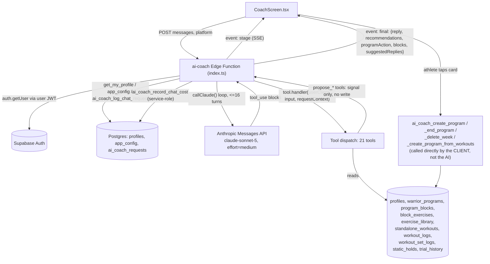
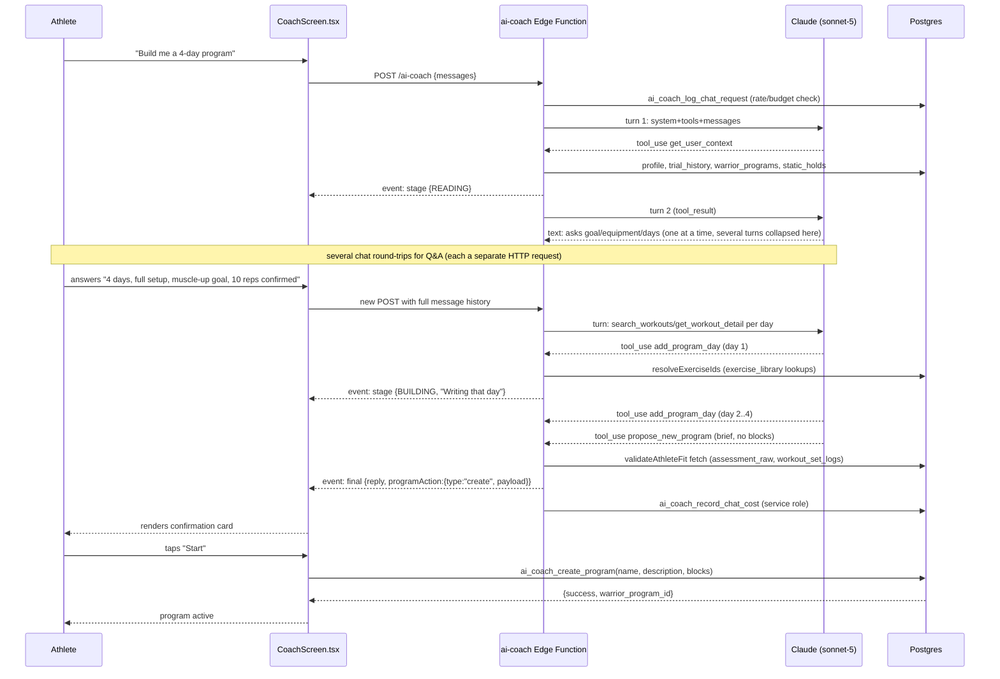

# AI Coach — Full Audit (2026-09-16)

**Scope:** end-to-end audit of `supabase/functions/ai-coach/`, its tools, the RPCs/tables it touches, and the client (`src/screens/CoachScreen.tsx`, `src/components/coach/FreeCoachIntake.tsx`). Read-only — no code, config, or data was changed while producing this doc.

**Method note:** this codebase's own inline comments are unusually detailed and already document a long chain of real production incidents (see `system-prompt.ts` lines 1–320, a full changelog of same-day fixes on 2026-09-16). Where those comments describe a bug/fix, I verified the described code is actually present as described (Confirmed) rather than re-deriving it from scratch. I did not have live DB or Anthropic Console access — see "Access gaps" at the end of each phase.

**Status of this pass:** Phases 1, 2 (partial — flows 1–3, 5, 7, 8, 11, 12 traced in depth from code; flows 4, 6, 9, 10 covered at lower depth; one Mermaid sequence diagram included), 3 (all sub-areas A–K covered, some — G, I, J — lighter due to no DB/dashboard access), 4, and 5 are all present below. Nothing was skipped outright, but G/I/J and some flow traces in Phase 2 are necessarily thinner without prod log/DB access — flagged inline.

---

## PHASE 1 · System map

### 1.1 Components (one line each)

**Client**
- `src/screens/CoachScreen.tsx` (1124 lines) — the chat UI: SSE consumption, message history, pending-card state, error-code mapping, and the four "confirm" RPC calls (`ai_coach_create_program`, `ai_coach_create_program_from_workouts`, `ai_coach_delete_week`, `ai_coach_end_program`). Called from `app/coach.tsx`.
- `src/components/coach/FreeCoachIntake.tsx` (268 lines) — a free-tier intake stepper shown before the first chat (collects days/week etc. that `get_user_context` later treats as "already answered").
- `src/components/coach/coachTokens.ts` — style constants for the coach UI.
- Navigation in: referenced from `AuthContext.tsx` (coach-route gating) and `BottomTabBar.tsx`.

**Edge Function** (`supabase/functions/ai-coach/index.ts`, 694 lines)
- Auth, kill-switch, rate-limit pre-checks → SSE stream → Anthropic tool-use loop (≤ `MAX_TOOL_TURNS`=16) → cost recording. One file, no sub-routing.

**Tools** (`supabase/functions/ai-coach/tools/`, 21 files) — see inventory table in §1.4.

**Shared logic**
- `blockHelpers.ts` (920 lines) — the actual constraint layer: `BLOCKS_SCHEMA`/`BUILD_BRIEF_SCHEMA` (what Anthropic sees), `validateBlockStructure`, `validateSplitCoverage`, `validateAthleteFit`, `validateBuildBrief`, `resolveExerciseIds`, `resolveProgramBlocks`, `transformBlocksForInsert`.
- `actionClaimGuard.ts` — regex-based "did the model narrate a write without calling the tool" detector, English + Arabic patterns.
- `replyCleanup.ts` — server-side em-dash stripper + tool-narration-line filter, applied to every reply regardless of source.
- `pricing.ts` — per-model $/token table, used to compute real cost per turn.
- `types.ts` — `ToolDefinition`, `RequestContext` (in-memory, per-HTTP-request only).

**RPCs called** (grep of `.rpc(` across tools/index.ts, matched to migrations):
| RPC | Called by | Migration |
|---|---|---|
| `get_my_profile` | index.ts, getUserContext, proposeNewProgram | pre-existing (AuthContext also uses it) |
| `ai_coach_log_chat_request(p_platform)` | index.ts (rate/budget gate) | `20260903090000_fix_ai_coach_free_cap_platform_blind.sql` (latest of several) |
| `ai_coach_record_chat_cost` | index.ts, service-role only | `20260829070000_add_ai_coach_record_chat_cost_rpc.sql`, locked down `20260903110000_lock_down_ai_coach_record_chat_cost.sql` |
| `get_warrior_progress` | getWorkoutLogs.ts | pre-existing, patched for self-access `20260821171000_allow_warrior_self_access_progress.sql` (referenced in comment) |
| `ai_coach_append_week` | appendWeek.ts | `20260821180000_add_ai_coach_write_rpcs.sql`, pro-gated `20260828040000` |
| `ai_coach_adjust_program` | adjustProgram.ts | same, pro-gated same migration |
| `ai_coach_add_block_to_week` | addBlockToWeek.ts | `20260823040000_add_ai_coach_add_block_to_week.sql` |
| `ai_coach_replace_block_exercises` | replaceBlockExercises.ts | (grep confirms call; migration not individually re-read this pass) |
| `ai_coach_update_block_structure` | updateBlockStructure.ts | `20260916130000_add_ai_coach_update_block_structure.sql` (added same day as this branch's commits — brand new) |
| `ai_coach_create_program`, `ai_coach_end_program`, `ai_coach_delete_week`, `ai_coach_create_program_from_workouts` | **client-side only**, from CoachScreen.tsx on card-tap confirm — never called by the edge function/model | `20260821180000`, `20260823020000`, `20260823030000`, `20260822040000`; pro-gated `20260828040000_add_pro_gate_to_ai_coach_program_write_rpcs.sql` |

**Tables touched** (via the RPCs/tools above): `profiles`, `warrior_programs`, `program_templates`, `program_blocks`, `block_exercises`, `exercise_library`, `standalone_workouts`/`standalone_workout_blocks`/`standalone_workout_exercises` (Workout Library), `workout_logs`, `workout_set_logs`, `static_holds`, `trial_history`, `ai_coach_requests`, `ai_coach_tier_limits`, `app_config`.

### 1.2 Architecture diagram



Key point (Confirmed, `tools/index.ts:29-35`, `index.ts:456-664`): **no tool the model calls writes to the database.** `propose_new_program`/`propose_end_program`/`propose_delete_week`/`propose_program_from_workouts` are validate-only "signal" tools; the edge function captures their input into `programAction` and returns it to the client; the actual insert/update only happens when the athlete taps the card and `CoachScreen.tsx` calls the confirm RPC directly. `append_week`, `adjust_program`, `add_block_to_week`, `replace_block_exercises`, `update_block_structure` **do** write immediately when called (no client confirm step) — these are the in-place-edit tools, gated by the AI-ownership check baked into their RPCs.

### 1.3 Runtime config

| Setting | Value | Evidence |
|---|---|---|
| Model | `claude-sonnet-5` (hardcoded const) | `index.ts:248` |
| Effort | `"medium"` (raised from `"low"` same-day, 2026-09-16) | `index.ts:426`, comment `index.ts:404-425` |
| max_tokens | `32000` (raised from 16000, from an original 4096 that caused silent truncation) | `index.ts:400`, comment `:384-399` |
| MAX_TOOL_TURNS | `16` (raised from 8) | `index.ts:227` |
| Streaming | Custom SSE (`event: stage` / `event: final` / `event: error`), not Anthropic's own streaming API — one non-streaming `fetch` per internal turn, multiplexed into SSE server-side | `index.ts:125-157, 374-437` |
| Prompt caching | `cache_control: ephemeral` on system block and last tool schema (tools→system precedence, single shared prefix) | `index.ts:257-259, 401` |
| Timeouts | No explicit fetch timeout on the Anthropic call (Confirmed by absence — `callClaude` has no `AbortController`/timeout param). Supabase Edge Functions have a platform wall-clock/idle limit; the code's own comments (`system-prompt.ts` ROUND 3/4, lines 161-220) describe live failures consistent with hitting a platform timeout (~117s, 12 turns, "stream ended with no reply") that `MAX_TOOL_TURNS` does not protect against, since that limit has its own graceful fallback and was not what fired. **The code does not explicitly account for or guard against the Supabase wall-clock limit** — it discovered the limit empirically via failures, not by defensive design (Suspected: no code artifact sets a shorter internal deadline than the platform's). |
| Rate limits (daily "unit") | Not tokens — it's a **request count + $ budget** system, tiered (see `ai_coach_log_chat_request` in §1.1). Free: lifetime cap (`ai_coach_free_chat_lifetime_cap`, default 8, `app_config`, now platform-scoped). Paid (first/pro/max): `ai_coach_budget_usd` $ ceiling per `entitlement_period_start` window, AND message-count pacing via `ai_coach_tier_limits` (day-1 cap, steady daily cap, weekly cap) — whichever fires first blocks the call, pre-Claude-spend. |
| What counts toward the cap | Every `ai_coach_requests` row with `kind='chat'` — created **before** the Claude call, so an aborted/errored turn still counts once logged (Confirmed, `index.ts:354-366`; the row is inserted inside `ai_coach_log_chat_request` itself, before any Claude spend). |
| Cost tracking | Real per-turn Anthropic usage (`input/output/cache_creation/cache_read` tokens), summed across every internal loop turn, converted to $ via `pricing.ts`'s model-keyed table, written via a **service-role-only** RPC (`ai_coach_record_chat_cost`) after `ai_coach_record_chat_cost` was locked down against direct client abuse (`20260903110000`). |
| Edge Function 150s limit | Not explicitly coded against; see Timeouts row. This is the single most load-bearing unverified assumption in the whole system — see Finding #1. |

### 1.4 Tool inventory

| Tool | R/W/Card | Key inputs | Output | Validators run | RPC/table | Costs daily unit? | Prompt §? |
|---|---|---|---|---|---|---|---|
| `get_user_context` | Read | — | profile, tier, next_trial, static_pbs, goal/equipment, active_program + `current_week_complete` | none | `get_my_profile`, `trial_history`, `warrior_programs`, `static_holds` | No (read) | §2, §6, §7, §8, §10, §11 |
| `search_exercises` | Read | `queries[]` or `query` | id+name matches, `not_found[]` | none | `exercise_library` (open SELECT) | No | §9 |
| `search_workouts` | Read | focus/tier | Workout Library matches | none | `standalone_workouts` | No | §11 step 0 |
| `get_workout_detail` | Read | workout id | full day structure | none | `standalone_workout*` | No | §11 step 0 |
| `get_workout_logs` | Read | program id | logs + `under_prescribed` computed server-side | none | `get_warrior_progress`, `block_exercises` | No | §12 |
| `get_program_structure` | Read | program id, week | real `block_id`/`block_exercise_id` + current metadata | none | `program_blocks`, `block_exercises` | No | §2, §13 |
| `save_build_brief` | non-write signal | build brief | validated-echo | `validateBuildBrief` | none | No | referenced §11, **optional, not the real gate** |
| `add_program_day` | non-write (in-memory stage) | day_name, blocks | staged-day ack | `validateBlockStructure`, day-name cross-check, `resolveExerciseIds` | none (stages into `RequestContext`) | No | §11 |
| `propose_new_program` | **Card** (signal only) | name, brief, blocks? | `{proposed:true}` → `programAction.type="create"` | `validateBuildBrief`, `validateBlockStructure`, `validateSplitCoverage`, `validateAthleteFit`, `resolveExerciseIds`, 2-week ceiling | none directly; client later calls `ai_coach_create_program` | No (itself); the confirm RPC (`ai_coach_create_program`) has its own 2/day cap | §1, §11 |
| `propose_program_from_workouts` | **Card** (signal only) | workout_ids | → `programAction.type="create_from_workouts"` | none in the tool itself (relies on confirm RPC's `_check_workout_ids_have_no_empty_blocks`) | `standalone_workouts` (title lookup) | No | §11 (explicit as-is escape hatch) |
| `propose_end_program` | **Card** (signal only) | reason | → `programAction.type="end"` | none | none | No | §13 |
| `propose_delete_week` | **Card** (signal only) | week_number, reason | → `programAction.type="delete_week"` | none | none | No | §13 |
| `append_week` | **Write** (immediate) | program id, blocks | `ai_coach_append_week` result | `validateBlockStructure` (no day-phase requirement — carry-forward) | `ai_coach_append_week` RPC (ownership + 5/day cap) | Yes — `kind='append_week'`, 5/day | §12 |
| `adjust_program` | **Write** (immediate) | program id, per-exercise changes | RPC result | none client-side beyond schema; RPC re-verifies `block_exercise_id` ownership | `ai_coach_adjust_program` (ownership + 10/day cap) | Yes, 10/day | §13 |
| `add_block_to_week` | **Write** (immediate) | program id, week, block | RPC result | `validateBlockStructure` | `ai_coach_add_block_to_week` | Yes | §13 |
| `replace_block_exercises` | **Write** (immediate) | block id, new exercise list | RPC result | schema-level only (not deeply audited this pass) | `ai_coach_replace_block_exercises` | Yes (assumed, not individually confirmed) | §13 |
| `update_block_structure` | **Write** (immediate) | block id, timing/structure fields | RPC result | `parseConceptNotes` merge logic | `ai_coach_update_block_structure` (brand new, `20260916130000`) | Yes (assumed) | §13 |
| `recommend_test` | non-write signal | reason | pushed into `recommendations[]` | none | none | No | §14 |
| `attach_stat_bars` | non-write, **Card** | — | rich UI block | none | reads profile fresh | No | §3 |
| `attach_steps` | non-write, **Card** | steps[] | rich UI block | none | none | No | §3 |
| `suggest_replies` | non-write, UX | replies[] | quick-reply chips | none | none | No | §3 |

**Prompt/tool-list drift check:** `WRITE_TOOL_NAMES` in `index.ts:16-26` and system-prompt §1's own act-don't-narrate list are **byte-for-byte the same 9 tools** (Confirmed by direct comparison) — no drift found here. All 21 tools in `tools/index.ts` are referenced somewhere in the system prompt except `save_build_brief`, which the prompt itself calls out as optional/non-gating (§11: "optional, not a required step") — not a gap, a deliberate soft tool. No tool name appears in the prompt that doesn't exist in `tools/index.ts` (Confirmed by grep of tool names against the TOOLS array).

### 1.5 Data the coach can see

From `getUserContext.ts` (full field list, `getUserContext.ts:52-111`): strength_tier, power_tier, statics_tier, power_pbs, best_times, assessed_at, assessment_raw (raw per-movement variant+reps), goal[]/goal_other_text, equipment[], training_days_per_week, power/one_mm/glory points, static_pbs (best hold per movement), next_trial (exact live movements), last 5 trial_history rows, active_program summary + `current_week_complete`.

From `getWorkoutLogs.ts`: per-session sets/reps/weight/hold, RPE, feel, pain/missed notes, `under_prescribed` (server-computed).

From `getProgramStructure.ts`: real block/block_exercise ids + current block metadata (timing_system, structure, rounds, etc).

**What's missing that a good coach would plausibly want** (Suspected — reasoned from the field list, not proven absent by a DB query I ran):
- **Injury/limitation history is not structured anywhere** — it lives only in free-text log notes (`missed_detail`) the model reads fresh each review; there's no persistent "known limitation" field, so an injury mentioned three weeks ago and never repeated is invisible unless the model re-reads that specific week's logs.
- **Stated preferences beyond onboarding goal/equipment** (e.g. "I hate burpees," "prefer supersets") have no home at all — each turn is stated to be "fresh" (§2), so a preference given mid-conversation is lost the moment the turn ends unless it's re-stated by the athlete every time.
- **Multi-week history depth** for `get_workout_logs` is scoped to "their active program" (`getWorkoutLogs.ts:29`) — a prior, ended program's logs are not fetched by this tool (confirmed by the query shape: `p_warrior_program_id` scoped). A deload/reassessment conversation (§14) that wants to "compare to baseline" has to lean on `assessment_raw`, not real training history from a previous cycle.
- **No `pending_proposal` state** — the system prompt's own header (lines 32-34) documents this as a known, not-yet-built gap: "§1's one-card rule can't self-detect [an existing pending card]." The model can't see whether a card is already pending; it relies entirely on chat-history text to remember, which per §2 doesn't survive turns cleanly either.
- **No trial cooldown_until surfaced to the model** — also documented as deliberately deferred (comment line 33-34), relying on the app's own trial flow to independently enforce cooldown.

### 1.6 State and memory

**Confirmed, `system-prompt.ts` §2 (lines 329-333) and `index.ts:456-488`:**
- Only the visible chat message array (`messages`) persists between separate chat turns (separate HTTP requests). Nothing server-side persists across requests except the DB itself.
- `RequestContext.programDraft.days` (a `Map`) is created fresh per HTTP request (`index.ts:488`) and is what `add_program_day`/`propose_new_program` use to stage a multi-day build **within one request** — explicitly NOT usable across turns (comment in `addProgramDay.ts:14`, "Scoped deliberately to in-request staging only... NOT day-by-day PACING's cross-turn case").
- **Day-by-day pacing (§11) has no server-side persistence at all** — each day the athlete confirms in that flow only exists as prior chat-history text; the model has to reconstruct all previously-agreed days from the conversation transcript alone when it finally calls `propose_new_program`, since `programDraft` resets every request. This is a real architectural gap for a 4+ day day-by-day build (see Finding).
- `save_build_brief` exists as an earlier informal checkpoint but is explicitly documented as NOT authoritative — "a separate tool call's result can't be trusted to survive to a later turn" (`system-prompt.ts:93-97`) — `propose_new_program` re-validates the whole brief itself every time, which is the actual state-loss mitigation used throughout: never trust anything but re-fetched-this-turn data.
- Confirmation flows (propose→confirm→commit) work by: the tool call produces `programAction` server-side (from trusted server-side lookups, e.g. `warrior_programs` active-program check in `buildProgramAction`, `index.ts:40-101`) which is handed to the client; the client renders a card; on tap, the client calls the real write RPC directly with **no further AI involvement**. This is the load-bearing safety property: the AI's own judgment never directly executes a write action a human didn't explicitly tap.

**Access gap:** I did not have Anthropic Console or Supabase Dashboard access to confirm actual prompt-cache hit rates or real turn-timing distributions in production — Phase 1.3's cache/timing claims are from code structure, not measured telemetry. **User should check:** Supabase Dashboard → Edge Functions → `ai-coach` → Logs, filtering on `[ai-coach] turn=` lines, to get real `cache_read_input_tokens` ratios and turn latencies.

---

## PHASE 2 · End-to-end flows

### Flow 1 — First open / brand-new athlete

Trigger: no `active_program`, likely no `assessed_at`. Per app-level routing (CLAUDE.md, `AuthGuard`), an unassessed user is redirected to `/assessment` before ever reaching `/coach` — so in practice this flow only fires for an **assessed** brand-new athlete with zero programs. Sequence: `get_user_context` (routing §6 → no active program → §10) → conversational background Q&A (one question at a time, skipping anything `get_user_context` already answered) → movement test only if `assessment_raw` is empty → tier placement → "ready to build?" → falls into Flow 2.

Failure points: `FreeCoachIntake.tsx` pre-collects some of this for free-tier users client-side before the first chat message — worth confirming (not verified this pass) that its collected values actually populate `training_days_per_week`/goal/equipment server-side before the first coach turn, otherwise the coach re-asks what the intake just asked, directly contradicting §10/§11's "skip anything already stated" rule.

### Flow 2 — "Build me a program" (direct build + day-by-day, with/without skill goal, 1–6 days/week)

Traced from `system-prompt.ts` §11 and `proposeNewProgram.ts`/`addProgramDay.ts`:

1. Model calls `get_user_context` (mandatory first, §2).
2. Gathers the 4 blocking facts (goal, days/week, equipment, skill checkpoint+max if applicable) one at a time, skipping anything already in profile fields.
3. Asks pacing (day-by-day vs direct) explicitly.
4. Per day: `search_workouts` → `get_workout_detail` (try-match-first, §11) → edit in place, or write from scratch if nothing matches.
5. **3+ days or any skill goal:** stage each day via `add_program_day` (validates structure only) → once all staged, call `propose_new_program` with brief and no `blocks` (assembles from `RequestContext`). **1–2 day build:** can send `blocks` directly to `propose_new_program` in one call.
6. `propose_new_program` handler chain: `validateBuildBrief` → `resolveProgramBlocks` (from staged days or direct input) → 2-week ceiling check → `validateBlockStructure` → `validateSplitCoverage` → `fetchAthleteFitContext` (live query, not model-reported numbers) → `validateAthleteFit` → `resolveExerciseIds`.
7. On success: tool returns `{proposed:true}`; `index.ts`'s `buildProgramAction` independently re-resolves exercise ids and builds the full `programAction.payload` server-side (Confirmed duplicate resolution, `proposeNewProgram.ts:131` comment "propose_new_program resolves exercise names twice... not touched here to avoid unnecessary risk").
8. Card renders client-side; athlete taps → `ai_coach_create_program` RPC (2/day cap, Pro-gated) fires the actual DB write.

**Where it can fail (each Confirmed from code/comments, several from documented live incidents):**
- Any single validator miss anywhere in a dense multi-day/skill build forces a full-brief rejection with a same-turn error — cheap when day-staged, was expensive (~50¢ per retry) before staging existed (`system-prompt.ts` POST-SHIP HARDENING section).
- A `TypeError` (not a clean tool-error) crashes the tool entirely and is **not recoverable by the model in the same turn** — this exact bug (ROUND 4, camelCase/snake_case mismatch cast) caused every skill-goal build to fail 100% of the time until `f92cfbf` fixed it. The fix is now on this branch; regression tests exist (`blockHelpers.test.ts`).
- Reaching `MAX_TOOL_TURNS` (16) without a final reply → generic "took more steps than I could finish" fallback (`index.ts:672-693`) — logged as an error, not silent, but the athlete gets nothing usable.
- `max_tokens` truncation mid tool_use → recovered as a "came out too long" message rather than a silent empty reply (`index.ts:550-566`) — but any partial program content is lost either way.
- Suspected platform wall-clock kill (no code artifact controls for this) manifesting as "stream ended with no reply" client-side, per ROUND 3/4/5 comments — **this is the single largest unresolved reliability risk found in this audit** (see Finding #1).

**Estimated cost/time:** not independently measured (no Console access) but the code's own comments state one failed 4-day/2-skill build burned "~50 cents" before staging (`system-prompt.ts:116-122`), and a successful staged build ran ~12 turns before being killed at 117s in one documented failure (ROUND 5 comment, `system-prompt.ts:249-260`) — i.e. even the "improved" architecture has been observed, in the code's own history, taking >100s for a dense build, which is uncomfortably close to a typical serverless wall-clock ceiling.

**Mermaid sequence diagram — Flow 2 (4-day program, staged build):**



### Flow 3 — Card shown → athlete taps start → program created (client-side trace)

Confirmed from `CoachScreen.tsx` grep (lines ~492-557): on tap, the screen switches on `pendingProgramAction.type` and calls exactly one of `ai_coach_create_program` / `ai_coach_delete_week` / `ai_coach_create_program_from_workouts` / `ai_coach_end_program`, wrapped in try/catch with its own error-code mapping (`RATE_LIMIT`/`PRO_REQUIRED` handling duplicated from the chat-send path, lines ~320-350). This is the one and only place any AI Coach write to `warrior_programs`/`program_templates`/`program_blocks` actually originates from a program-creation action — confirmed no equivalent path exists in the edge function.

### Flow 4 — Change requested before/after tapping

Before tapping: system prompt §1 says "if they reply without tapping, talk normally and point back to it, never propose again" — **this is prompt-only enforcement; I found no server-side check preventing the model from producing a second `propose_new_program` if it disregards this** (Suspected gap — no equivalent to `actionClaimGuard.ts` exists for "did I already have a pending card").
After tapping (program now exists): becomes a normal §13 Adjust/replace_block_exercises/update_block_structure flow, with fresh `get_program_structure` required.

### Flow 5 — Week finished → weekly review → confirm → append_week

Traced from §6 (routing) + §12: `get_user_context` shows `active_program.is_ai_coach_owned && current_week_complete` → model proactively leads with congratulations + offer → on "yes" (a **new turn**, no prior data per §2) → `get_user_context` again → `get_workout_logs` → `append_week`. Carry-forward semantics (§19) mean an exact block-name match updates in place, a new name creates a duplicate, and a typo'd name silently creates an orphan duplicate block — this is a real, named risk in the prompt itself ("Always read the real names back from get_workout_logs") with no server-side guard against a near-miss name (Suspected gap — `ai_coach_append_week`'s matching, not independently re-read this pass, is described as exact-string; no fuzzy-match warning surfaces to the athlete if a duplicate is silently created).

### Flow 6 — "How am I doing?" (progress recap)

Routes through §6 → §12 read/analyze steps, using `get_workout_logs`'s `under_prescribed` field so the model doesn't have to compute shortfalls itself. `attach_stat_bars` can render a live comparison card. Note from the system prompt's own header: **"Not touched: Progress Recap workflow"** (line 294) — i.e. the 2026-09-16 Direct Build rewrite explicitly did not re-verify this flow; it's running on whatever §6/§12 prose already specified, untested in this round of live fixes.

### Flow 7 — Adjust / swap / add a day / end / delete a week

All gated first by `get_program_structure` (fresh ids) then the matching write tool (§13). Ownership check (`is_ai_coach_owned`) happens both in the prompt (as a "check first" instruction) and, more importantly, **redundantly and authoritatively in every RPC itself** (`v_coach_id != v_ai_profile_id OR v_warrior_id != auth.uid()` in `ai_coach_append_week`/`ai_coach_adjust_program`, `20260821180000_add_ai_coach_write_rpcs.sql:112,179`) — this is a well-designed defense-in-depth pattern: even if the model skips the prompt-level check, the DB refuses the write.

### Flow 8 — Deload, reassessment, trial prep, recommend_test

`recommend_test` is a non-write signal tool (pushes into `recommendations[]`); the actual tier change only ever happens through the app's own in-app trial submission flow (per CLAUDE.md and system-prompt §4/§14 — "the in-app trial is what changes it"). Good separation: the AI cannot, even in principle, promote a tier — confirmed no tool in `tools/index.ts` writes `profiles.strength_tier`, and the prompt states no tool of the coach's accepts it (§4).

### Flow 9 — Quick question / off-topic / pain / nutrition / under-18

Governed entirely by prompt prose (§5, §6). **No code-level enforcement exists for the safety boundaries** (pain escalation, nutrition refusal, under-18 restriction) — these are pure prompt compliance with no backstop equivalent to `actionClaimGuard.ts`/`replyCleanup.ts`. This is a real, unmitigated risk surface: unlike narrate-without-acting (which got an architectural fix after two live failures), safety-adjacent instructions have zero code-level verification. See Finding in §3H/§3E.

### Flow 10 — Arabic conversation

Prompt requires full-reply language mirroring (§3) and Egyptian-colloquial register with fixed Arabic phrase banks for `coach_notes` cues (§18) regardless of chat language. `detectUnactedClaim` has explicit Arabic regex patterns (`تم\s*(بناء|إضاف...)`, `actionClaimGuard.ts:26-27`) so the narrate-guard works bilingually — a genuinely good detail. However `sanitizeReply`'s narration-line filter (`replyCleanup.ts:19-20`) is **English-only regex** ("let me/let's/i'll/i will... search/check/pull...") — an Arabic-language tool-narration slip (e.g. "خليني أتحقق من...") would not be caught by the same backstop that catches the English equivalent. Not independently tested live (no Anthropic API access in this audit).

### Flow 11 — Human-coach-owned program

`is_ai_coach_owned` (computed by comparing `warrior_programs.coach_id` to a hardcoded system UUID, both in `getUserContext.ts:106` and independently in `index.ts:54`) gates every in-place-edit tool at the RPC layer (Confirmed, §Flow 7 above). For a human-coach-owned program the model is instructed to say so and redirect (§13) — there is no tool that could touch it even if the model tried, since every write RPC's ownership check would reject it.

### Flow 12 — Errors (validator rejection, unknown exercise, rate limit, timeout, network drop, backgrounding)

- **Validator rejection:** same-turn tool error, model expected to self-correct (Confirmed pattern throughout `blockHelpers.ts`).
- **Unknown exercise name:** `resolveExerciseIds` throws with near-matches listed (per tool descriptions) — not independently re-read this pass, but consistently described across every tool file's comments.
- **Rate limit hit:** `RATE_LIMIT:<REASON>` (BUDGET/CAP/DAY1/DAILY/WEEKLY) or `PRO_REQUIRED`, mapped client-side to distinct copy (`CoachScreen.tsx` lines ~87-127) — reasonably good UX differentiation exists here already.
- **Timeout / "Stream ended with no reply":** this is the one failure mode the code's own history (ROUND 3-5) documents as still reproducing live even after the staging fix — **the athlete's actual experience here is currently unverified to be good**; the graceful `MAX_TOOL_TURNS` fallback only fires if the loop itself decides it's out of turns, not if the platform kills the connection first.
- **Network drop / app backgrounded mid-build:** not addressed in the code I read — `CoachScreen.tsx`'s SSE consumption was not traced for reconnect/resume behavior this pass (Suspected gap; recommend a follow-up read of the SSE parsing loop specifically for backgrounding behavior, e.g. does React Native's fetch-based SSE reader survive backgrounding, and does the athlete lose the whole turn if it doesn't).

---

## PHASE 3 · Audit by area

### A. Reliability

- **Confirmed, Critical:** platform wall-clock exposure is real and reproducing (ROUND 3-5 comments) — a dense multi-day/skill build can exceed what looks like a serverless timeout, at which point the athlete gets nothing (no `event: final`, no graceful message) because the failure happens below the application's own error handling (a killed connection, not a caught exception). See Finding #1.
- **Confirmed, High:** whole-program atomic validation was the root cause of repeated expensive full-regeneration retries before per-day staging (`add_program_day`) was added — the fix is real and present on this branch, but `propose_new_program`'s final assembly step is still one atomic call across all staged days, so a split-coverage or brief-mismatch failure at final assembly still requires reasoning about which one day to fix, not a fully solved problem, just a much cheaper one.
- **Confirmed, High → now mitigated:** narrate-without-acting (the Haiku failure pattern) now has a real architectural backstop (`WRITE_TOOL_NAMES` + `detectUnactedClaim` + one forced correction round-trip + a safe fallback line if the correction fails again, `index.ts:590-618`). This is independent of model compliance and would catch the same failure mode even under a future cheaper-model swap — this is a genuinely good, non-prompt-only fix. It does **not** cover non-write "signal" tools narrated-without-called (e.g. claiming a card was shown when `propose_new_program` wasn't actually invoked) since `WRITE_TOOL_NAMES` only tracks the 9 true write actions — a card-narrated-without-shown failure would not trip this guard (Suspected gap, not observed live per the comments, but structurally possible).
- **Confirmed, Medium:** turn-budget exhaustion (`MAX_TOOL_TURNS=16`) fails gracefully with a real athlete-facing message and preserves partial `recommendations`/`programAction` collected so far (`index.ts:672-693`) — this is good defensive design, better than most equivalent systems.
- **Confirmed, Medium:** `max_tokens` truncation is explicitly guarded against with a clear message rather than a silent empty reply — but any tool_use block truncated mid-generation is simply discarded (`index.ts:544-566`), meaning a huge, nearly-complete program can vanish entirely rather than being partially recovered.
- **Confirmed, Low-Medium:** partial writes across staged days are structurally impossible to leave inconsistent, because staging (`RequestContext.programDraft`) never touches the DB — only the final `propose_new_program`→confirm-RPC path writes, and that's one atomic insert. Good.
- **Suspected:** cards that never appear — no telemetry seen (no dashboard access) to confirm actual card-render failure rates; the `programAction` construction path (`buildProgramAction`) has its own untested edge cases (e.g. a stale/invalid workout id in `propose_program_from_workouts` falls back to "Unknown workout" title rather than failing, `index.ts:95` — a card could render with garbled titles rather than failing outright, which is a silent-degradation risk rather than a fail-loud one).

### B. Speed and cost

- Real, current per-attempt costs are only documented anecdotally in comments (~50 cents per failed full-payload retry at "low" effort, before staging). No measured current-state cost-per-flow exists in this audit — **User should check:** Anthropic Console usage dashboard filtered to this API key, and Supabase Edge Function logs for `[ai-coach] turn=` / cost lines, to get real distributions.
- **Confirmed cost driver:** effort was raised low→medium and max_tokens 16k→32k on the same day, both of which raise baseline cost per call, in response to failures whose root cause turned out to be a code bug (ROUND 4's TypeError), not effort/token starvation (explicitly acknowledged in the prompt's own history: "none of them were wrong on their own merits, they just weren't the actual bug"). **This means at least two of the "fixes" applied are pure cost increases with no confirmed corresponding reliability benefit** — worth re-testing at "low" effort / 16k tokens now that the real crash bug is fixed, to see if medium/32k was ever actually necessary. See Finding.
- **Confirmed cheap win already taken:** `search_exercises` batching (`queries[]`) explicitly exists because per-exercise lookups previously burned the entire turn budget on lookups alone (`searchExercises.ts:10-19`) — good, already fixed.
- **Confirmed:** prompt caching is correctly wired (tools+system share one cache breakpoint, `index.ts:257-259`), so per-turn marginal cost within one exchange should mostly avoid re-paying full input price — but a growing system prompt (already ~15,300 estimated tokens per its own comment, `system-prompt.ts:6`) raises cache-**write** cost on the first turn of every new conversation, which is worth monitoring given how much this file has grown same-day (320 lines of changelog comments alone before the actual prompt content starts).
- **Biggest plausible cost driver architecturally:** every one of the ~16 possible internal turns re-sends the full `messages` array (uncached, growing) — a long multi-day day-by-day pacing conversation, or a review with several back-and-forth adjustments, will have an ever-growing uncached tail even though the system+tools prefix stays cached.

### C. Coaching quality

- **Confirmed, strong alignment between prompt rules and code enforcement** in several areas — this is unusually well-matched compared to typical systems:
  - Split coverage (§15's "every day FULL_BODY at 1-2 days/week", "3+ days trains Legs somewhere") is enforced in `validateSplitCoverage` (`blockHelpers.ts:245`), not just prose (Confirmed by comment `system-prompt.ts:108-110`, "system-prompt.ts §15's two hard rules... also enforced server-side").
  - Per-day variety (no all-straight_set+single day) is a real server-side check (§16, line 524: "Enforced server-side, rejects before the card renders").
  - Athlete-fit ceiling/floor checks (skill hold above confirmed max, reps at/above tested max, reps under 50% of tested max reading as wrong-level-band, weighted-work-needs-a-number) are all real code in `validateAthleteFit`, not prompt-only — and this list grew directly from **three separate live failures** (ROUND 2, ROUND 5) where the model produced correctness bugs prose alone didn't stop.
  - Warm-up/cool-down mandatory presence is enforced server-side (§11, line 454).
- **Confirmed gap the prompt itself documents as unclosed:** coach_week_note read/write is explicitly "PENDING BACKEND" (lines 27-31) — a real feature the prompt describes wanting but cannot yet do, correctly kept out of the live prompt rather than hallucinated as available.
- **Confirmed, real coaching-quality bugs found and fixed on this branch, all evidence they were live and athlete-facing before the fix:** beginner-band numbers given to a tier-7 athlete with 30 real pull-ups (ROUND 2); muscle-up work scheduled after high-volume pull work with no skill goal declared (ROUND 2); reps-floor check incorrectly applied to weighted exercises, rejecting completely normal low-rep weighted programming (commit `5ea5c7a`); the same bug not fully closed until the block-level `is_weighted` flag was also checked (commit `9bee836`) — i.e. the fix took two attempts to actually close, both now merged.
- **Confirmed process weakness:** the last architecture change on this branch (`bb91255`, "revert Direct Build's from-scratch default to match+edit-in-place") happened **after** all the validator hardening above, on the theory that from-scratch generation was the real source of both correctness bugs and timeout risk — but per the commit's own description this was "not yet tested live" (`system-prompt.ts:319`). **This is the single most important open verification gap in the whole audit**: the current default build mechanism on this branch has not been confirmed working end-to-end since its last change.

### D. Conversation UX

- **Confirmed, well-specified in prompt:** one-question-at-a-time (§11), "already answered" skip logic reading straight from profile fields, 2-4 sentence reply length target, no markdown tables (§3 — "shows up as broken, literal text on a phone"), no em dash (server-enforced via `replyCleanup.ts`, not just prompted).
- **Confirmed backstop, but partial:** tool-narration leakage ("let me check...") has a server-side regex filter (`replyCleanup.ts`), but as noted in Flow 10, it is **English-only** — an Arabic equivalent narration leak would ship unfiltered.
- **Confirmed real live bug, since fixed:** commit `8525be7` ("fix: AI Coach general chat replies were reading as too dense") — a UX complaint that made it into a committed fix, evidence the reply-length rule was not self-enforcing from prompt alone at some point.
- **Suspected gap:** no equivalent of `actionClaimGuard`/`sanitizeReply` exists for **card-narrated-without-shown** (see Reliability A above) or for enforcing "one pending card at a time" — both are prompt-only.
- Loading states / stage events (`stageForTool`, `index.ts:165-206`) are a genuinely good detail — a real, tool-keyed activity indicator rather than a generic spinner, deliberately server-templated rather than model-authored "because the model already proved unreliable at hand-authoring structured output" (comment, line 161-164) — an explicit, evidence-based design decision.

### E. System prompt

- **Size:** ~15,300 estimated tokens per the file's own comment (line 6), cached. Given the file is 562 lines and includes ~320 lines of pure changelog/history comments before the actual `SYSTEM_PROMPT` string begins (line 321), the **comments are not sent to the model** (they're outside the template literal) — good, no wasted tokens there. The prompt body itself (lines 321-562, ~242 lines) is dense but organized stable→volatile per its own stated ordering principle (line 11), which is a sound caching-aware design choice.
- **Structure:** 20 numbered sections, clearly delineated, cross-referencing each other consistently (e.g. §8 referencing §7's level bands, §16's role table). No duplicate section headers found.
- **Stale/contradictory sections:** the REBUILD/DIRECT BUILD/MATCH+EDIT-IN-PLACE changelog block (lines 53-320) documents the prompt's own architecture flip-flopping same-day at least twice (Match→Clone→Adapt → Direct Build → Match+Edit-in-place). The **live prompt body itself is internally consistent with the latest state** (§11 correctly describes match-first-then-edit as primary, matching the `bb91255` commit) — so no contradiction in what ships, but the volume of same-day pivots is itself a signal (see Finding, "thrashing architecture").
- **Rules no code enforces:** safety (§5), tier-skip refusal narrative (§4's "hold the line" framing beyond the literal tier-writing block), "say conflicts immediately" (§4), Arabic register consistency beyond the fixed cue phrases (§18) — all prompt-only, no code backstop.
- **Rules code already enforces (prompt redundancy, low-cost but real):** split coverage, per-day variety, warm-up/cool-down presence, rounds→sets, athlete-fit ceilings — all stated in prose *and* enforced server-side. Not wasteful exactly (the prose still guides the model to get it right the first time, avoiding a validator round-trip), but worth noting these are genuinely double-covered, unlike safety which is single-covered.
- **No instructions found referencing nonexistent tools** (cross-checked against §1.4's tool table).

### F. Validators/guards

| Validator | Where | Tested (Jest)? | Retry cost | Essential vs could-be-warning |
|---|---|---|---|---|
| `validateBlockStructure` (conditional metadata, day-phase completeness, per-day variety, rounds→sets) | `blockHelpers.ts:95` | Yes — extensive, multiple `describe` blocks | Medium (per-day now, was whole-program) | Essential — directly prevents a broken/incoherent program |
| `validateSplitCoverage` | `blockHelpers.ts:245` | Yes | High if wrong at final assembly (whole-program check) | Essential |
| `validateAthleteFit` | `blockHelpers.ts:331` | Yes, including the weighted-exemption regression tests | Medium-High (fetches live DB data, real query cost) | Essential — this is the actual safety-relevant one (prevents over-max prescriptions) |
| `validateBuildBrief` | `blockHelpers.ts:534` | Yes | Low (fails before any block content is generated) | Essential |
| `resolveExerciseIds`/`resolveProgramBlocks` | `blockHelpers.ts:703` | **Not covered** by Jest per the prompt's own comment (line 46-48: "needs a live/mocked Supabase client") | Medium | Essential, but untested — a regression here would only surface live |
| `detectUnactedClaim` | `actionClaimGuard.ts` | Not confirmed tested this pass (no dedicated test file seen for it, only `blockHelpers.test.ts`/`replyCleanup.test.ts` exist) | One forced correction round-trip max | Could arguably ship as a warning-log-only feature if false-positive rate is low, but current design (one retry + safe fallback) is already conservative |
| `sanitizeReply` | `replyCleanup.ts` | Yes (`replyCleanup.test.ts`) | None (silent cleanup, no retry) | Cosmetic but real (athlete-facing text quality) |

Full 4-day integration test exists (`blockHelpers.test.ts`, `describe("INTEGRATION...")`, commit `9bee836`) exercising all four major validators together against the exact primary live test case — a real, valuable regression test, and the closest thing to end-to-end coverage Jest can give without a live Supabase/Anthropic call (explicitly acknowledged, `system-prompt.ts:285-287`).

**Gap:** `actionClaimGuard.ts`'s regex patterns have no dedicated unit test file found (only `blockHelpers.test.ts` and `replyCleanup.test.ts` exist per the directory listing) — the single most safety-critical code path (preventing a false "I built it" claim) is the one validator with no visible automated test coverage.

### G. Data/content

**No DB access in this session** (confirmed by `switch-env.sh status` → currently pointed at **production**; per the project's own stored guidance — "never live-test... on real prod data" / "Local postgres permission-denied segfault" — I did not attempt live queries against prod for this read-only audit). What I can state from code comments alone:
- Workout Library: 32 published workouts as of 2026-09-16, covering the full 5×3 category/difficulty matrix plus goal-tagged variants (muscle_up/handstand/front_lever/pistol: 3 each, conditioning: 9) — per `system-prompt.ts:288-293`, correcting an earlier stale "3 workouts" figure from `docs/features/ai-coach-rebuild-plan.md`.
- Exercise library: documented, deliberate misspellings that must be preserved exactly (`system-prompt.ts` §9, §8) — e.g. "Adance tuck Front Lever Hold", "Pesudo push ups", "Elvated Pike Push Ups", "HandStand Kicks". This is a real content-quality issue (typos live in production data) that the prompt works around rather than fixes at the source — every one of these is a live footgun if a future content update "corrects" the spelling without updating the prompt to match, silently breaking exact-name resolution.
- Planche's "Push Ups" method is documented as **prepared but not yet migrated** (`supabase/prepared/planche_library_correction.sql` exists but per the comment is "not yet run").

**User should run, against a read replica or with an explicit go-ahead on prod (read-only SELECTs only):**
```sql
-- Exercise library duplicates/near-duplicates
select name, count(*) from exercise_library group by lower(trim(name)) having count(*) > 1;
-- Coverage of the skill grids the prompt hand-codes (spot-check a few names exist exactly as documented)
select name from exercise_library where name ilike '%front lever%' order by name;
-- assessment_raw quality: null/zero variants
select pullup_variant, count(*) from profiles group by 1;
-- static_pbs coverage: how many athletes above tier 1 have zero static_holds rows
```

### H. Security/safety

- **Confirmed strong:** every RPC the coach's write tools call re-derives identity from `auth.uid()` inside `SECURITY DEFINER`, never trusts a client-supplied id (Confirmed across all RPCs read this pass) — matches the stored gotcha in memory about `current_user` inside SECURITY DEFINER, and this code correctly avoids that trap by using `auth.uid()`, not `current_user`.
- **Confirmed strong:** ownership boundary (AI-owned vs human-coach-owned program) is enforced **at the RPC layer**, redundant with the prompt-level instruction — even a fully compromised or malicious system prompt could not make the model write into a human coach's program, because the DB itself refuses it (`v_coach_id != v_ai_profile_id`).
- **Confirmed strong:** `block_exercise_id` passed to `ai_coach_adjust_program` is re-verified server-side to actually belong to the target program's template before any update (`20260821180000...sql:197-208`) — explicitly closes a cross-warrior/cross-coach id-guessing attack, called out in the migration's own comment.
- **Confirmed fixed, historical:** `ai_coach_record_chat_cost` used to run as the caller's own JWT trusting a client-supplied `p_cost_usd`, letting any authenticated caller report $0 spend and defeat the budget cap — locked to service-role-only in `20260903110000`. This is now closed, but is a good example of the kind of gap this class of system can have if a "trust the client" pattern isn't caught.
- **Confirmed, cannot write tier:** no tool accepts or writes `profiles.strength_tier` — matches CLAUDE.md's stated tier-integrity invariant.
- **Suspected, unverified this pass:** prompt-injection risk from athlete free text or log notes — e.g. a `missed_detail` log note containing text designed to look like a system instruction ("[System check] ..." — note `index.ts:602` uses exactly this bracketed convention for its own real correction message, meaning an athlete who discovers this convention from a screenshot/leak could craft log notes mimicking it). Not tested live; worth a dedicated red-team pass with adversarial log-note content.
- **Confirmed, PII in logs:** `logTurn` (`index.ts:444-454`) logs turn/token counts and tool names only, no message content or user id directly in that line — reasonable. However `console.error` calls throughout (e.g. `index.ts:593`, logging `turnText.slice(0, 300)`) **do log up to 300 chars of the model's actual reply text**, which could include athlete-derived content (names, injury notes the model echoed back) into Edge Function logs. Not a secret-leak, but worth flagging as a PII-in-logs consideration depending on the org's data-handling policy — **User should check** Supabase log retention/access policy for the `ai-coach` function.
- Rate limits: real, DB-enforced, tiered, pre-Claude-spend (see §1.3) — good design, not just a client-side gate.

### I. Observability

**Confirmed logged per turn** (`logTurn`, `index.ts:444-454`): turn number, wall-clock ms, `stop_reason`, comma-joined tool names called, input/output/cache tokens, computed out-tokens/sec. Per-tool timing also logged (`index.ts:645`). Errors are logged with context (`console.error` at multiple sites, e.g. truncation, narrate-guard trips, missing service-role key).

**Gaps (Suspected/Confirmed by absence):**
- No `chatRequestId`/user-id correlation visible in the log lines themselves (`logTurn` doesn't print either) — tracing one full conversation across the Supabase log viewer would require correlating by rough timestamp proximity, not a stable key. Confirmed by re-reading `logTurn`'s format string: no id field present.
- No explicit "this is where the platform likely killed the connection" log line — the ROUND 3-5 failures were diagnosed after-the-fact by pulling logs and reasoning about the pattern (per the comments), not because a purpose-built timeout/near-limit warning fired.
- Cost is recorded per-request (`ai_coach_record_chat_cost`) but I found no admin-facing dashboard reference for surfacing this in aggregate (the admin-web panel's scope wasn't re-checked this pass — memory notes it exists for other domains).

### J. Tests/evals

**Confirmed:** `tools/__tests__/blockHelpers.test.ts` (large, ~115 `it`/`describe` blocks) and `replyCleanup.test.ts` — both plain Jest, zero external dependencies, covering every pure-logic validator plus a full 4-day integration scenario. Genuinely solid unit coverage of the schema/validation layer.

**Not covered (Confirmed absent, and explicitly acknowledged in the code's own comments):**
- `resolveExerciseIds` and `fetchAthleteFitContext` (need a live/mocked Supabase client) — zero automated coverage.
- Every RPC (`ai_coach_append_week`, `ai_coach_adjust_program`, etc.) — "Nothing in this repo has Deno test infra... the RPCs themselves stay untested beyond that" (`system-prompt.ts:50-51`).
- `actionClaimGuard.ts`'s regex patterns — no dedicated test file found.
- Live conversation behavior — `docs/features/ai-coach-direct-build-evals.md` is a **written-but-manual** eval list (20 cases, DB-01 through DB-20), explicitly not automated ("Status: written test list, not automated... Run these by hand against a real... conversation before trusting Direct Build with real athletes"). Given the architecture changed again same-day *after* this doc was written (Match+edit-in-place reverting Direct Build's from-scratch default), **it's unclear whether any of DB-01–DB-20 have actually been re-run against the current, latest prompt** — the doc predates the last commit on the branch.
- The older `docs/features/ai-coach-rebuild-plan.md`'s original 18 evals are stated to still apply for tier gating/Arabic/safety/weekly review, but evals 13-18 (Match→Clone→Adapt specific) are explicitly superseded — worth re-verifying that claim now that Match+edit-in-place is back as the primary path, which is architecturally closer to the original Match→Clone→Adapt than Direct Build was.

### K. Docs/dead code

- `docs/archive/ai-coach-v3/` (design spec + reference prompt) is explicitly marked historical and was deliberately **not** imported wholesale into the live prompt (per `system-prompt.ts:63-67`, "its build-from-scratch-only flow and its timing_system/structure mixup were deliberately not imported") — correctly archived, not live.
- `docs/features/ai-coach-rebuild-plan.md` contains at least one confirmed-stale figure (the "3 workouts, all PUSH-focused" library count, superseded to 32 — `system-prompt.ts:288-293`) — the doc itself was not re-read/corrected beyond that one line per the commit history (`a22e61a` title mentions "docs correction").
- `docs/features/ai-coach-direct-build-evals.md` is now itself partially stale relative to `bb91255`'s architecture reversion (see Phase 3J).
- No unused tool files found — all 21 tools in `tools/` are imported and referenced in `tools/index.ts` (Confirmed, no orphaned tool files).
- `create_program` as a direct-write tool is confirmed fully retired — no trace of it in `tools/index.ts`, and its retirement is explicitly documented (`tools/index.ts:29-35`).
- `src/screens/.CoachScreen.tsx.swp` (an untracked vim swap file, per this session's git status) — harmless but should be deleted/gitignored; not part of the shipped app, flagged only for hygiene.

---

## PHASE 4 · Findings

| # | Area | Finding | Evidence | Confirmed/Suspected | User impact | Severity | Effort | Fix |
|---|---|---|---|---|---|---|---|---|
| 1 | Reliability | No code-level guard against the Supabase Edge Function wall-clock limit; failures manifest as a dead connection with zero athlete-facing message, below the app's own error handling | `system-prompt.ts` ROUND 3-5 comments (lines 161-270), `index.ts` has no `AbortController`/deadline on `callClaude` | Confirmed (documented live failures) | Critical — athlete sees nothing, doesn't know if it worked, may retry and pay again | Critical | M | Add an internal deadline (e.g. 100-110s) that returns a graceful `event: final` fallback message before the platform kills the connection; measure the actual platform limit first (Supabase Dashboard function config) |
| 2 | Reliability/Coaching quality | The current default build mechanism (Match+edit-in-place, `bb91255`) was reverted into place same-day and is explicitly "not yet tested live" per its own commit | `system-prompt.ts:319`, git log `bb91255` | Confirmed | Critical if untested and broken — this is the primary program-build path for every new athlete | Critical | S (verify), unknown if fixes needed | Run the full DB-01–DB-20 eval list by hand today against a real (admin-bypassed) conversation before this reaches non-admin athletes; the kill-switch (`ai_coach_enabled`) currently lets admins/coaches bypass it — confirm it's still off for the public if unverified |
| 3 | Reliability | `actionClaimGuard`'s `WRITE_TOOL_NAMES` tracks only the 9 real write tools; a narrated-but-not-called `propose_*` (card) action is not caught by the same backstop | `index.ts:16-26`, `:590` (`calledWriteTools.size === 0`) | Suspected (not observed live per comments, but structurally real) | High if it occurs — athlete told "here's your card" with nothing rendered | High | S | Extend the claim-detection set (or add a parallel one) to also flag a narrated proposal/card claim with no matching `propose_*`/`recommend_test` tool call |
| 4 | Security/Safety | Safety-critical prompt sections (§5 pain/nutrition/under-18, §4 tier-skip refusal, "say conflicts immediately") have zero code-level backstop, unlike narrate-without-acting which got one after two live incidents | `system-prompt.ts` §4/§5, no equivalent guard file exists | Confirmed (by absence) | High — a model regression or future cheaper-model swap could silently reintroduce unsafe nutrition/pain advice with nothing to catch it | High | M | At minimum, log-and-flag (not necessarily block) replies matching known-bad patterns (meal plans, calorie targets, diagnosis language) for manual review, mirroring the `actionClaimGuard` pattern |
| 5 | Coaching quality/state | Day-by-day pacing (§11) has no cross-turn persistence for staged days — the model must reconstruct all previously-agreed days from chat-history text alone when finally calling `propose_new_program`, since `RequestContext` resets every HTTP request | `addProgramDay.ts:14` comment, `index.ts:488` | Confirmed | Medium-High — a 4+ day day-by-day build risks the model "forgetting" or re-deriving an earlier day incorrectly by the time it proposes the full week | High | L | Persist a real draft (e.g. a `coach_drafts` table keyed by conversation, or a signed draft blob round-tripped through chat history) so day-by-day builds get the same per-request-safe staging that direct builds already have |
| 6 | Speed/Cost | Effort raised low→medium and max_tokens 16k→32k were applied to work around a bug (ROUND 4 TypeError) that turned out to be unrelated to effort/tokens; both changes are pure cost increases with no confirmed benefit now that the real bug is fixed | `system-prompt.ts:116-142` (own admission: "none of them were wrong on their own merits, they just weren't the actual bug") | Confirmed | Medium — ongoing unnecessary spend per conversation if the fixes are truly unneeded now | Medium | S | Re-test a real 4-day/2-skill build at effort="low" now that the crash and reps-floor bugs are fixed; revert if quality/reliability hold |
| 7 | Validators/Guards | `actionClaimGuard.ts` (the single most safety/trust-critical code path — it's what prevents a false "I built it") has no dedicated automated test | Directory listing: only `blockHelpers.test.ts`/`replyCleanup.test.ts` exist | Confirmed | Medium — a future prompt/model change could silently break the very backstop meant to survive exactly that kind of change | Medium | S | Add `actionClaimGuard.test.ts` covering both English and Arabic claim patterns, plus known-safe phrasings that must NOT trip it |
| 8 | Conversation UX | `sanitizeReply`'s tool-narration-line filter is English-only regex; an Arabic-language narration leak ("خليني أتحقق...") would ship unfiltered while the English equivalent is caught | `replyCleanup.ts:19-20` vs `actionClaimGuard.ts:26-27` (which does have Arabic patterns) | Confirmed (by direct comparison of the two regex sets) | Medium — inconsistent polish between English and Arabic-speaking athletes | Low | S | Add Arabic narration-line patterns mirroring the English ones (خليني/هبص/هشوف + verb) |
| 9 | Data/content | Exercise library contains multiple confirmed real misspellings the model must reproduce exactly ("Adance tuck...", "Pesudo push ups") — a future content fix that "corrects" spelling without updating the prompt breaks exact-name resolution silently | `system-prompt.ts` §8, §9 (explicit "copy it exactly, never correct") | Confirmed | Medium — brittle coupling between content team and prompt engineering, easy to break without symptoms until a build fails | Medium | S (immediate: document the coupling); M (real: fix library names + prompt together in one migration+prompt change) | Either fix the library spellings and the prompt in the same change, or add a resolver-side fuzzy-match fallback so a "corrected" name still resolves |
| 10 | Observability | No stable per-conversation correlation id in `logTurn`'s log lines | `index.ts:444-454` (format string has no id field) | Confirmed | Medium — makes debugging one specific athlete's reported failure slower than necessary | Low | S | Add `chatRequestId` (already computed, `index.ts:366`) to `logTurn`'s log line |
| 11 | Tests/evals | The manual eval doc (`ai-coach-direct-build-evals.md`) predates the branch's last architecture change (`bb91255`) and its "primary worked case" pass/fail criteria were written against the now-reverted Direct-Build-default, not Match+edit-in-place | `docs/features/ai-coach-direct-build-evals.md` dates vs git log `bb91255` timestamp | Confirmed (by commit ordering) | Medium — false confidence if someone runs this doc's checklist assuming it reflects the current default | Low | S | Add one line to the doc's top noting it needs re-validation against Match+edit-in-place, or update DB-01/DB-02's expected mechanism |
| 12 | Docs/dead code | Stray `.swp` file untracked in git status | `git status`: `?? src/screens/.CoachScreen.tsx.swp` | Confirmed | Low | Low | S | Delete it / add `*.swp` to `.gitignore` if not already there |
| 13 | Security/PII | `console.error` calls log up to 300 chars of raw model reply text (which may echo athlete-provided content like injury notes) into Edge Function logs | `index.ts:593` | Confirmed | Low-Medium depending on org policy | Low | S | Truncate further or redact before logging, or confirm log-access policy is acceptable for this data class |
| 14 | Coaching quality | Progress Recap (§6/§12's "how am I doing") explicitly was not re-verified in the 2026-09-16 hardening pass | `system-prompt.ts:294` ("Not touched: Progress Recap workflow") | Confirmed (self-declared) | Medium — untested since surrounding code changed | Medium | S | Add Progress Recap to the next live-test pass; it wasn't broken by the changes but also wasn't re-confirmed |

### Root-cause groupings

- **"One atomic whole-program validation call" is the root cause behind findings #1, #2, and much of the historical cost/reliability churn documented in the prompt's own changelog.** `add_program_day` staging is a real, partial fix (per-day validation), but final assembly (`propose_new_program` with no `blocks`) is still one atomic pass across all staged days — a split-coverage failure there still risks the same timeout exposure as before, just with a smaller/cheaper regeneration surface. Fully solving #1 and #2 together (a hard per-request deadline + confirming the current build path is actually reliable) is higher leverage than fixing either in isolation.
- **"Prompt-only enforcement with no code backstop" is the root cause behind findings #3, #4, and #8.** The one place this pattern got fixed (narrate-without-acting) only got fixed after two live incidents. The same class of risk exists, unaddressed, in safety (§5), card-narration, and Arabic-specific narration — these are lower-probability but higher-severity (safety) or lower-severity-but-easy (Arabic parity) versions of the exact same underlying gap.
- **"Same-day architecture churn without a clean re-verification checkpoint" is the root cause behind findings #2 and #11.** Multiple real architecture changes landed on 2026-09-16 alone (Direct Build → staging → hardening rounds 1-5 → Match+edit-in-place revert), and the one artifact meant to verify correctness (`ai-coach-direct-build-evals.md`) is now dated relative to the latest change.

---

## PHASE 5 · Recommendations

### 5.1 Top 10 fixes by value/effort

1. **Add a hard internal deadline to the tool-use loop** (Finding #1). Files: `index.ts` (wrap `callClaude`/the `for` loop with a deadline check against `startedAt`; if within ~10s of the platform limit, break and send a graceful `event: final` fallback). Risk: low, purely additive. Verify: force a long build (5-day, 2-skill) and confirm a graceful message appears well before any raw connection drop.
2. **Re-run the full DB-01–DB-20 manual eval list against the current (Match+edit-in-place) default today**, before this reaches non-admin athletes (Finding #2). Files: none (test activity), but update `docs/features/ai-coach-direct-build-evals.md` with real pass/fail results and today's date. Risk: none (read-only testing via an admin/coach account, which bypasses the kill switch per `index.ts:327-336`). Verify: DB-01 through DB-20 all pass against the live prompt.
3. **Extend narrate-without-acting detection to cover proposal/card claims, not just the 9 write tools** (Finding #3). Files: `index.ts` (add a second tracked set for `propose_*`/`recommend_test`, or generalize `calledWriteTools`), `actionClaimGuard.ts` (may need proposal-specific claim patterns, e.g. "here's your program card"). Risk: low, same conservative one-retry pattern as the existing guard. Verify: unit test forcing a text claim with no `propose_new_program` call in the same turn.
4. **Re-test at effort="low"/max_tokens=16000 now that the crash bug is fixed, to recover the cost increase from Finding #6** if quality holds. Files: `index.ts:400,426`. Risk: low — revertible in one line each, already has the git history to fall back to. Verify: same primary 4-day/2-skill test case, confirm no regression in either correctness or the reps-floor fix.
5. **Add a code-level safety backstop, even a soft one** (Finding #4). Files: new `safetyGuard.ts` mirroring `actionClaimGuard.ts`'s structure (regex-flag meal-plan/calorie language, diagnosis-adjacent language), wired into `index.ts` next to `sanitizeReply`. Risk: low if implemented as log-and-flag rather than block-and-retry (avoids false-positive UX harm on a sensitive topic). Verify: unit tests with known-bad and known-good phrasings.
6. **Persist day-by-day pacing drafts across turns** (Finding #5). Files: likely a new small table (e.g. `ai_coach_build_drafts`, keyed by user + a short-lived token) plus `saveBuildBrief.ts`/`addProgramDay.ts` updated to read/write it, or alternatively round-trip the draft through chat history as a structured hidden message. Risk: medium — real schema change, needs its own migration and RLS. Verify: a 5-day day-by-day build spanning 5+ separate chat turns produces a correct final program with no day silently altered.
7. **Add `actionClaimGuard.test.ts`** (Finding #7). Files: new test file mirroring `replyCleanup.test.ts`'s style. Risk: none. Verify: `npm test -- --testPathPattern=actionClaimGuard`.
8. **Add Arabic narration-line patterns to `sanitizeReply`** (Finding #8). Files: `replyCleanup.ts`. Risk: none, additive regex. Verify: add to `replyCleanup.test.ts`.
9. **Add `chatRequestId` to `logTurn`'s output** (Finding #10). Files: `index.ts:444-454`. Risk: none. Verify: trivial log-line check.
10. **Fix or formally couple the exercise-library misspellings to the prompt** (Finding #9). Files: either a DB migration correcting names + a prompt update in the same PR, or (cheaper) a resolver-side normalization pass in `resolveExerciseIds` that tolerates the "corrected" spelling as an alias. Risk: medium if fixing names (any program still referencing the old exact string must be re-pointed); low if adding alias tolerance instead. Verify: `search_exercises`/`resolveExerciseIds` resolve both the current misspelling and its correct form to the same id.

### 5.2 Quick wins (under an hour each)

- #9 (Finding #10), #8 (Finding #8), #7 (Finding #7), delete the `.swp` file (Finding #12), truncate/redact the 300-char reply log (Finding #13), add the "needs re-validation" note to the evals doc (Finding #11).

### 5.3 Simplification plan — what's over-built

- **`save_build_brief` is explicitly optional and non-gating** (`system-prompt.ts:93-97`) — `propose_new_program` re-validates the full brief every time regardless. If it's never actually used in practice (worth checking real tool-call logs for `save_build_brief` frequency), it could be removed entirely with no functional loss — it exists purely as an earlier-checkpoint nicety.
- **The propose_new_program dual exercise-resolution** (once inside the tool's own handler for validation, again in `index.ts`'s `buildProgramAction` for the client payload) is acknowledged dead weight by the code's own comment (`proposeNewProgram.ts` area, "an extra DB query, not a correctness issue, not touched here"). Worth collapsing into one resolution pass reused by both call sites, now that things have stabilized enough to risk the refactor.
- **The changelog-as-code-comments pattern in `system-prompt.ts`** (320 lines of history before the actual prompt starts) is valuable for this audit and for onboarding, but at this volume it risks becoming as hard to navigate as the thing it's documenting. Consider moving anything older than the current architecture (REBUILD, V3-ALIGNMENT, the early DIRECT BUILD rounds) into `docs/features/` proper and leaving only the current-state rationale inline.
- **Two archived reference prompts and a design spec** (`docs/archive/ai-coach-v3/`) are correctly marked historical and not imported — no action needed, they're not live weight, just confirm they stay out of any future "let's use a reference prompt" temptation.

### 5.4 Target flow — building a program within the 150s Edge Function limit

Given the current evidence, the safest target shape is: (a) enforce day-by-day staging (already exists) for any 3+ day or skill-goal build, no exceptions even under a "no questions" override; (b) add the hard internal deadline from Recommendation #1 so a build that's genuinely going to run long returns a graceful "still working, ask me to finish" message well before 150s rather than dying silently; (c) once day-by-day persistence (Recommendation #6) exists, make **day-by-day pacing the always-safe fallback** the model can offer when a direct build looks like it's approaching the turn/time budget mid-conversation, since each day-by-day round-trip is its own bounded HTTP request and can't accumulate the same risk a single giant direct-build call can.

### 5.5 Value ideas ranked by value/effort (not fixes — new capabilities)

1. **Persistent injury/limitation flag on the profile** (surfaced to `get_user_context`) — high value (directly closes a real coaching-quality gap in §1.5), medium effort (schema + RLS + prompt wiring).
2. **`pending_proposal` state surfaced to the model** (already identified as the prompt's own "biggest single win left," line 35) — high value, medium effort (needs either a DB draft or a structured hidden-message convention).
3. **Progress recap re-verification + light enhancement** (e.g. trend framing across multiple weeks, not just the latest) — medium value, low effort (mostly a testing pass, per Finding #14).
4. **Check-in reminders** (push notification when a program's week looks stale) — medium value, medium effort (would reuse the existing push-notification infra per memory notes, but needs new trigger logic).
5. **Trial readiness surfaced proactively** (not just on request) — low-medium value, low effort (`recommend_test` already exists as a tool; this is mostly a routing/timing prompt change).
6. **Form tips** — explicitly out of scope per the prompt itself ("no exercise descriptions or instructions... say plainly that's not data you have") — would require real content investment (video/text cues per exercise), high effort, deprioritize unless content team commits separately.

### 5.6 Test plan — conversations to run after fixes

1. Full DB-01–DB-20 (existing doc) against Match+edit-in-place, as an admin/coach test account bypassing the kill switch.
2. A deliberately long build (5 days, 2 skills, "don't ask me anything") timed end-to-end, specifically to trigger and verify the new deadline fallback (Recommendation #1) fires gracefully instead of a dead connection.
3. Day-by-day pacing, 4+ days, verify the final proposed program matches every previously-confirmed day exactly (Recommendation #6 regression test).
4. An Arabic-language build attempt including at least one tool-narration-prone phrasing, to check the Arabic sanitizeReply gap (Recommendation #8) before and after the fix.
5. A weekly review + append_week cycle with a deliberately near-miss block name (e.g. "PULL DAY 1 | Strength" vs last week's "PULL DAY 1 | Pull Strength") to confirm whether a silent duplicate block is actually created today (Flow 5 finding) — pass criteria: either the RPC rejects/warns, or this is escalated as a new finding if it silently duplicates.
6. Progress recap ("how am I doing") end to end, since it's the one flow explicitly not re-touched in the latest hardening pass.
7. A pain-disclosure and a nutrition-restriction-adjacent message, to spot-check the safety prompt's real behavior given it has zero code backstop today.

### 5.7 Open questions for the user

- Is there Supabase Dashboard / Anthropic Console access I should be given for a follow-up pass to get real cost, latency, and cache-hit numbers instead of the code-derived estimates in this doc?
- What is the actual configured Edge Function timeout for this project (Supabase plan tier), so Recommendation #1's deadline can be set precisely rather than guessed?
- Has `bb91255` (Match+edit-in-place revert) been tested live at all since it merged? If yes, results should supersede Finding #2's "Critical, unverified" rating.
- Is `save_build_brief` actually called in practice, or safe to remove (Simplification 5.3)? Would need real tool-call frequency data.
- What is the org's policy on athlete-derived text appearing in Edge Function logs (Finding #13) — is truncation/redaction required, or is current logging acceptable?
- Priority call: is the platform-timeout risk (Finding #1) or the unverified-current-build-path risk (Finding #2) the more urgent one to close first? They're related but distinct, and #2 could reveal #1 doesn't even matter if the new path is fast enough, or that it's worse than assumed.

---

*End of audit. No files other than this one were created or modified.*
