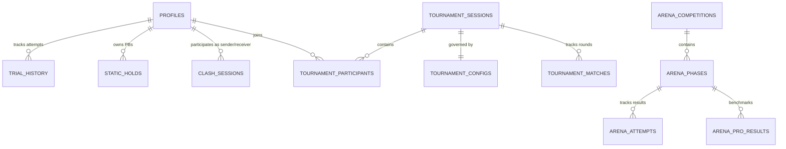

# Database Architecture: Anti-Gravity Engine

The Anti-Gravity backend is powered by Supabase (PostgreSQL), utilizing complex relational structures, triggers, and Row Level Security (RLS) to maintain a secure and real-time competitive environment.

## 1. Core Entity Relationship Map (ERD)

## 2. Table Breakdown

### `profiles`
The central hub for user data. Extends `auth.users`.
- **Key Columns**: `strength_tier`, `power_tier`, `statics_tier`, `glory_score`, `best_times` (JSONB).
- **Triggers**: `on_auth_user_created` (auto-creation on signup).

### `clash_sessions`
Tracks real-time 1v1 PvP battles.
- **Status Flow**: `pending` -> `accepted` -> `active` -> `finished`.
- **Sudden Death**: The `winner_id` is set by the first user to report completion, locking the session.

### `tournament_sessions` & `tournament_participants`
Handles multi-round competitive events.
- **Tournament Types**: `knockout` (bracket elimination) and `rank_based` (cumulative score).
- **Scores**: Stored as JSONB in `participants`, mapping day/round to performance metrics.

### `static_holds`
Tracks isometric performance.
- **Constraints**: Unique index on `(user_id, movement_id)` ensures only the Personal Best (PB) is persisted.

## 3. Advanced Business Logic (Triggers & Functions)

### `handle_clash_victory()`
Automatic Glory distribution after a clash.
- **Winner**: +25 GP.
- **Loser**: -15 GP (capped at 0).
- **Draw**: +5 GP to both.

### `get_arena_worldwide_rankings()`
A complex SQL query that:
1. Unions professional athlete benchmarks (`arena_pro_results`).
2. Appends the current user's best attempt from `arena_attempts`.
3. Applies a window function `RANK()` to generate a unified worldwide ranking.

## 4. Security Philosophy (RLS)
The database uses "Defensive Ownership" logic:
- **Write Permission**: `auth.uid() = user_id`.
- **Read Permission**: Public leaderboards are handled through Postgres **Views** to prevent exposing sensitive user data (email, push tokens).
- **Logic Integrity**: Critical competitive transitions (finishing a clash, advancing a round) are performed via **RPCs with SECURITY DEFINER**, meaning the code runs with admin privileges but follows strict internal validation that users cannot bypass.

## 5. Performance Considerations
- **JSONB Usage**: `best_times` and `scores` use JSONB for flexibility. As the user base grows, indexing specific keys within these blobs may be required.
- **Sudden Death Race Conditions**: Prevented by `FOR UPDATE` row-level locking in the `finish_clash_session` function.
