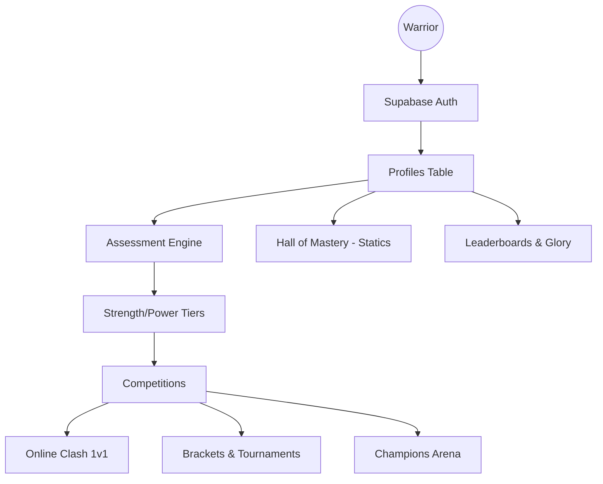

# Project Overview: Anti-Gravity (Leap CalisPath)

Anti-Gravity (Leap CalisPath) is a high-performance, gamified calisthenics training and competition platform. It combines physical assessment with a tiered progression system, global leaderboards, and real-time multiplayer "Clashes".

## Core Purpose
The platform is designed to transform calisthenics training into a competitive sport. It provides users with objective benchmarks (tiers), allows them to "Clash" with other athletes in real-time, and participate in global tournaments.

## Main Systems

### 1. Progression & Tiering System
*   **Strength Tiers**: 9 tiers ranging from "Helot" to "Eternity".
*   **Power Tiers**: 9 tiers ranging from "Spark" to "Voltaic".
*   **Statics Tiers**: Tracked separately for isometric holds.
*   **Glory Score**: A unified metric calculating overall athletic standing based on tiers, volume, and streaks.

### 2. Assessment Engine
*   **Initial Assessment**: Mandatory diagnostic test (Pull-ups, Push-ups, Dips, Muscle-ups) to determine starting tier.
*   **Power Assessment**: Explosive power testing.
*   **Tier Advancement**: Locked-gate progression where users must pass trials to advance.

### 3. Tournament & Competition System
*   **Tournament Lobby**: A structured tournament system with brackets (Developing/Elite).
*   **Champions Arena**: Elite-level circuit competitions.
*   **Weekly Challenges**: Community-wide events.
*   **Online Clash**: Real-time 1v1 PvP battles with "Sudden Death" finish logic.

### 4. Hall of Mastery (Static World)
*   A specialized isometric hold tracking system with its own "Well-Rounded" leaderboard.

## Main User Types
1.  **Warriors (Athletes)**: The primary users focused on training, competing, and climbing the ranks.
2.  **Admins**: System managers who can manage tournaments and system parameters (detected via `is_admin` flag and `AdminTournamentScreen`).

## Technology Stack
*   **Frontend**: React Native with Expo (TypeScript).
*   **Backend**: Supabase (PostgreSQL, Auth, Realtime).
*   **Styling**: Custom Theme System (Themed backgrounds, high-performance "Warrior" HUDs).
*   **Navigation**: React Navigation.

## Ecosystem Map

